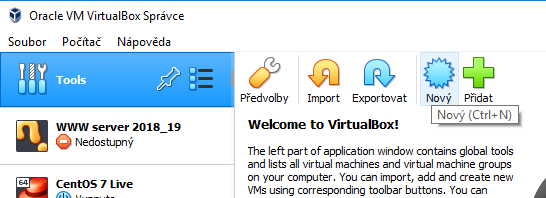

# Analýza datagramů ve Wiresharku

## Co je Wireshark?

Wireshark je softwarový nástroj, který umožňuje:
- sledovat datagramy, které jsou přijímány a odesílány síťovou kartou.
- prozkoumat podrobně datagram v hexadecimálním zápisu (jako posloupnost čísel v šestnáctkové soutavě) i v&nbsp;podobě určené pro snadné čtení.

Wireshark je k&nbsp;dispozici zdarma a mohou ho využívat například správci sítě při analýze datového toku!

> POZOR!!! Wireshark pouštějte vždy POUZE v&nbsp;domácí síti nebo ve **cvičné** síti! Při snímání datagramů můžete za jistých okolností získat obsah datagramů jiných osob, což by bylo porušení soukromí při komunikaci!
>
> I&nbsp;správce sítě by měl vždy předem použití Wiresharku v&nbsp;pracovní síti ohlásit, popsat účel sledování a jaká data se budou sledovat!

## Postup úlohy:

### Připravte si virtuální stroje:
1. Nejprve si stáhněte virtuální disk s&nbsp;připraveným webovým serverem. 
    - Obraz virtuálního disku s&nbsp;nainstalovaným webovým serverem máte připraven na serveru `\\dilna` ve sdílené složce `\\dilna\VM-sablony`. Soubor se jmenuje `Debian-lab-pos-www.vdi` 
      Sdílenou složku si připojíte pomocí Průzkumníka souborů: 
      
    - Obraz virtuálního disku si zkopírujte na disk `D:` do kořenového adresáře. 
      (Pokud už obraz na disku `D:` máte, můžete použít stávající.)

1. Ve VirtualBoxu si připravte virtální stroj s&nbsp;webovým serverem 
     
1. Ponechte 1&nbsp;GB operační paměti a připojte obraz virtuálního disku: 
    
1. Virtuální stroj se serverem WWW spusťte:
     
1. Spusťte druhý virtuální stroj &mdash; klienta 
    Zatímco server bude poskytovat webový obsah ke stažení, virtuální stroj s&nbsp;Windows bude sloužit ke spuštění Wiresharku a snímání datagramů. 
1. V&nbsp;nastavení síťové karty obou strojů zvolte položku `Vnitřní síť`:  
     
1. Nastavte IP adresu klientského stroje (Windows) na 192.168.0.10/24 

Nyní tedy máte spuštěny dva virtuální stroje:
1. webový server (Debian + Apache)
2. Klientský stroj (Windows)

### Spusťte snímání datagramů a analyzujte datagramy:
1. Na klientském stroji (Windows) spusťte Wireshark 
1. V&nbsp;prohlížeči na klientském stroji otevřete webovou prezentaci ze serveru &mdash; měla by se vám zobrazit úvodní stránka Apache. 
1. Spusťte snímání datagramů 
1. Obnovte obsah webové stránky pomocí klávesové zkratky _Ctrl+F5_ 
1. Až komunikace skončí, vypněte snímání datagramů 
1. Vyfiltrujte si pouze komunikaci HTTP v&nbsp;rámci jednoho TCP spojení 
1. Prozkoumejte, zda průběh komunikace odpovídá poznatkům o fungování protokolu TCP ze 2. ročníku 
1. Wireshark vám zobrazí:
    - seznam nasnímaných datagramů
    - podrobné informace o konkrétním datagramu, které si můžete po vrstvách rozbalit a prohlédnout (informace jsou již dekódovány do čitelné podoby)
    - hexadecimální zápis datagramu (přesné hodnoty nasnímaných oktetů tak, jak dorazily k&nbsp;síťové kartě)

    
1. Po skončení úlohy vypněte stroje:
    - Windows vypněte standarně _Start &rarr; Vypnout..._
    - Do Debianu se přihlaste stejnými přihlašovacími údaji jako u stroje s&nbsp;Windows a vypněte jej příkazem: `sudo systemctl poweroff` (musíte znovu zadat heslo).
