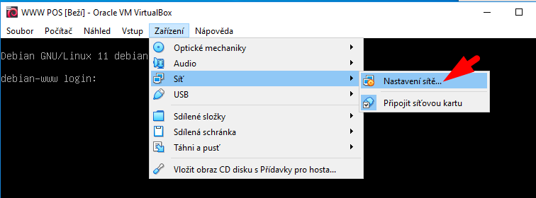

# Analýza datagramů ve Wiresharku

## Co je Wireshark?

Wireshark je softwarový nástroj, který umožňuje:
- sledovat datagramy, které jsou přijímány a odesílány síťovou kartou.
- prozkoumat podrobně datagram v hexadecimálním zápisu (jako posloupnost čísel v šestnáctkové soutavě) i v&nbsp;podobě určené pro snadné čtení.

Wireshark je k&nbsp;dispozici zdarma a mohou ho využívat například správci sítě při analýze datového toku!

> POZOR!!! Wireshark pouštějte vždy POUZE v&nbsp;domácí síti nebo ve **cvičné** síti! Při snímání datagramů můžete za jistých okolností získat obsah datagramů jiných osob, což by bylo porušení soukromí při komunikaci!
>
> I&nbsp;správce sítě by měl vždy předem použití Wiresharku v&nbsp;pracovní síti ohlásit, popsat účel sledování a jaká data se budou sledovat!

## Postup úlohy:

1. Nejprve si ve VirtualBoxu připravte virtální stroj s&nbsp;webovým serverem 
    Obraz virtuálního disku s&nbsp;nainstalovaným webovým serverem máte připraven na serveru `\\dilna` ve složce `\\dilna\VM-sablony`
     
1. &nbsp; 
1. &nbsp; 
1. &nbsp; 
1. &nbsp; 
1. &nbsp; 
1. &nbsp; 
1. &nbsp; 
1. &nbsp; 
1. &nbsp; 
1. &nbsp; 
1. &nbsp; 
1. &nbsp; 
1. &nbsp; 
